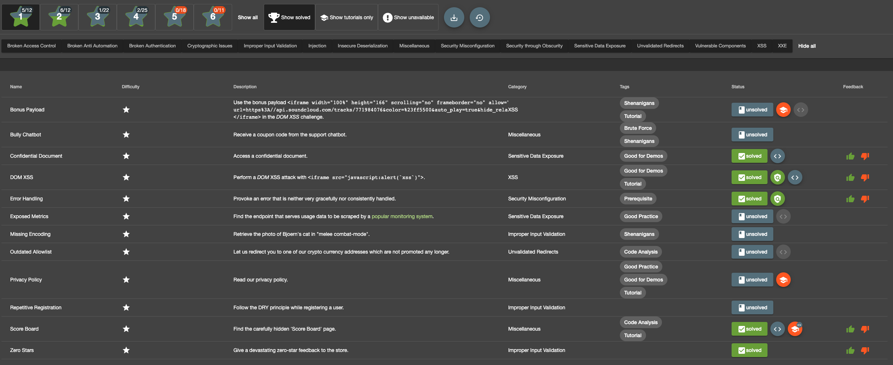

# A01: Broken Access Control

**Access Control** enforces policy such that users cannot act outside of their intended permissions. Failures typically lead to unauthorized information disclosure, modification, or destruction of all data or performing a business function outside the user's limits. Common access control vulnerabilities include:

* Violation of the principle of least privilege or deny by default, where access should only be granted for particular capabilities, roles, or users, but is available to anyone.
* Bypassing access control checks by modifying the URL (parameter tampering or force browsing), internal application state, or the HTML page, or by using an attack tool modifying API requests.
* Permitting viewing or editing someone else's account, by providing its unique identifier (insecure direct object references)
* Accessing API with missing access controls for POST, PUT and DELETE (i.e. CSRF).
* Elevation of privilege. Acting as a user without being logged in or acting as an admin when logged in as a user.
* Metadata manipulation, such as replaying or tampering with a JSON Web Token (JWT) access control token, or a cookie or hidden field manipulated to elevate privileges or abusing JWT invalidation.
* CORS misconfiguration allows API access from unauthorized/untrusted origins.
* Force browsing to authenticated pages as an unauthenticated user or to privileged pages as a standard user.

## Table of Challenges

   * [Prepare for the challenges:](#prepare-for-the-challenges)
   * [Challenge 1: Find the Score Board with the challenge overview](#challenge-1-find-the-score-board-with-the-challenge-overview)
      * [Tips:](#tips)
   * [Challenge 2: Find the Admin Page](#challenge-2-find-the-admin-page)
      * [Tips:](#tips-1)
   * [Challenge 3: Show the basket of another user:](#challenge-3-show-the-basket-of-another-user)
      * [Tips:](#tips-2)
   * [Challenge 4: Write a comment in the name of another user:](#challenge-4-write-a-comment-in-the-name-of-another-user)
      * [Tips:](#tips-3)
   * [Challenge 5: Change the description of the product OWASP SSL Advanced Forensic Tool (O-Saft)](#challenge-5-change-the-description-of-the-product-owasp-ssl-advanced-forensic-tool-o-saft)
      * [Tips:](#tips-4)

**HINT:** Make sure that you download [Postman](https://www.getpostman.com/apps).

## Challenges

### Prepare for the challenges:
Before starting the first challenge, try to become familiar with the **OWASP Juice Shop**. Try out the functionalities in the menu bar like the `Contact Us`-Button or the `Search`-Field, have a look at the **Login Site** and **create an account** in the **OWASP Juice Shop**. After you have done the **user registration**, there might be several new functions as a logged in user which you should also try out. 

### Challenge 1: Find the Score Board with the challenge overview

The **Score Board** provides an overview of all challenges in the **OWASP Juice Shop**. This subpage cannot be found by navigating through the application, because there is no direct button redirecting to the Score Board yet.  
Try to find this secret subpage!

#### Tips

- **Tip:** You can try to guess the URL.

- **Tip:** Have a look at the **Web Development Tools** of **Mozilla Firefox** or **Google Chrome**

- **Tip:** **Firefox Users**: The tab `Debugger` --> `Sources` of the **Web Development Tool** will help you.  
**Google Chrome Users**: The tab `Sources` --> `Page` of the **Web Development Tool** will help you.

- **Tip:** The file `main.js` may include useful information.

### Challenge 2: Find the hidden Admin Page
Similar to the **Score Board**, the **Admin Page** is also hidden in the application and cannot be called by clicking a certain link.  
Try to find this subpage!

#### Tips:

1. **Tip:** Have a look at the tips of [Challenge 1](#challenge-1-find-the-score-board-with-the-challenge-overview)

2. **Tip:** Make sure that you are a user in the **OWASP Juice Shop**

3. **Information:** You cannot access this page without being an authorized user. Probably you could already guess that from the code. Note down this path for later challenges.

### Challenge 3: Show the basket of another user:
Try to show a **basket** of a registered user of the **OWASP Juice Shop** which is not currently logged in.

#### Tips

- You have to be logged in with a registered user
- While interacting with the **basket**, have a look at the HTTP calls
- **Firefox Users**: The tab `Storage` might help you  
- **Chrome Users**: The tab `Application` might help you

### Challenge 4: Write a comment in the name of another user:
Submit a comment in the `Contact Us` section in the name of the administrator.

#### Tips:

1. **Tip:** The **Web Development Tool** could help you

2. **Tip:** **Firefox Users**: The tab `Console` might help you.  
**Chrome Users**: The tab `Elements` might help you.

3. **Tip:** Search in the source for hidden input fields.

4. **Tip:** Think about a certain attribute you have to change in the database for modifying the author of the written comment. A search in the sources after the name of this attribute might help you.

### Challenge 5: Change the description of the product "OWASP SSL Advanced Forensic Tool (O-Saft)"
Replace the description of the product **OWASP SSL Advanced Forensic Tool (O-Saft)**. The description should only consist of the word `More...`, which links to `https://owasp.slack.com` (the developer of the **OWASP Juice Shop**).

#### Tips:

1. **Tip:** Capture the HTTP calls in the `Console` while interacting with the product.

2. **Tip:** Try to find out the id of **OWASP SSL Advanced Forensic Tool (O-Saft)**.

3. **Tip:** Try to interact with the **API** via [Postman](https://www.getpostman.com/apps).

4. **Tip:** The sources could reveal the exact path to interact with the **API**.

5. **Tip:** You can solve the challenge by submitting one **PUT** request.
